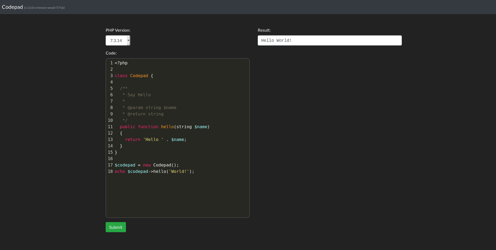

[](https://github.styleci.io/repos/179174116)

## System Requirements
- build-essential 
- pkg-config
- libcurl4-openssl-dev
- libxml2-dev
- libtidy-dev

#### Optional

- bison
- re2c

## Quick install

Install PHP:

```bash
$ php cli/install --version="<(string)version>" --debug="<(bool)debug>"
```

Create jail:
```bash
$ sudo php cli/build --jail="<(string)jailpath>" --version="<(string)version>" --debug="<(bool)debug>"
```

## Downloading & Compiling

```php
<?php

require_once __DIR__.'/../vendor/autoload.php';

use Versyx\Codepad\Downloader\Cli;
use Versyx\Codepad\Compiler\Cli;

$debug = true;
$version = "7.1.30";
run(new Downloader($debug), new Compiler($debug), $version);

function run(Downloader $downloader, Compiler $compiler, string $version)
{
    try {
        $php = $downloader->setVersion($version)->download();
        $compiler->compile($php->getVersion(), $php->getTarget());
    } catch (\Exception $e) {
        echo $e->getMessage();
    }
}
```

## Deploying

### Creating the chrooted Jail

```php
<?php

require_once __DIR__.'/../vendor/autoload.php';

use Versyx\Codepad\Cli\Jailer;

$debug = true;
$version = "7.1.30";
run(new Jailer($debug), $version);

function run(Jailer $jailer, string $version)
{
    // Initialise the jail
    $jailer->setRoot('/opt/phpjail');
    $jailer->setDevices('bin','dev','etc','lib','lib64','usr');

    // Build chrooted filesystem
    $jailer->buildJail($version);
    $jailer->setPermissions(0711);
    $jailer->setOwnership('root', 'root');

    // Mount all devices
    $jailer->mountAll();

    // Add compiled PHP instance
    $php = '/php-' . $version;
    $jailer->mkJailDir($php);
    $jailer->mount('/tmp' . $php, $jailer->getRoot() . $php, 'bind', 'ro');
}
```

### Enabling the worker

You'll need to allow www-data to run the worker script as a privileged user, add entries for each compiled version to
 `/etc/sudoers` like so:


ubuntu:
```
www-data ALL =(ALL) NOPASSWD: /opt/phpjail/php-7.3.6/bin/php /var/www/codepad/http/worker.php 7.3.6
www-data ALL =(ALL) NOPASSWD: /opt/phpjail/php-7.0.33/bin/php /var/www/codepad/http/worker.php 7.0.33
```

centos:
```
apache ALL =(ALL) NOPASSWD: /opt/phpjail/php-7.3.6/bin/php /var/www/codepad/http/worker.php 7.3.6
apache ALL =(ALL) NOPASSWD: /opt/phpjail/php-7.0.33/bin/php /var/www/codepad/http/worker.php 7.0.33
```

This will restrict `www-data`'s|`apache`'s sudo privileges to only running the worker.

### How it Works

The PHP code and version is base64 encoded and submitted to `http/manager.php`, the manager then 
base64 decodes the data and runs a check on the code input against disabled functions, if the check
comes back clean, a new process is created with stream resources:

```php
$proc = proc_open("sudo /opt/phpjail/php-$ver/bin/php /var/www/" . env("APP_NAME") . "/public/http/worker.php $ver", [
    0 => ["pipe", "rb"],
    1 => ["pipe", "wb"],
    2 => ["pipe", "wb"]
], $pipes);
```

The PHP code is passed to `http/worker.php` from the manager via STDIN, the worker then creates a temporary file in
`/opt/phpjail`, sets its permissions to `0444` and then executes the file using the selected PHP version
instance, which is chrooted to `/opt/phpjail` as user `nobody`. If the code takes longer than five seconds to execute, 
the process will terminate.

```php
$starttime = microtime(true);
$unused = [];
$ph = proc_open('chroot --userspec=nobody /opt/phpjail /php-' . $argv[1] .'/bin/php ' . escapeshellarg(basename($file)), $unused, $unused);
$terminated = false;
while (($status = proc_get_status($ph)) ['running']) {
    usleep(100 * 1000);
    if (!$terminated && microtime(true) - $starttime > MAX_RUNTIME_SECONDS) {
        $terminated = true;
        echo 'max runtime reached (' . MAX_RUNTIME_SECONDS . ' seconds), terminating...';
        pKill($status['pid']);
    }
}

proc_close($ph);
```

## Example Deployment


